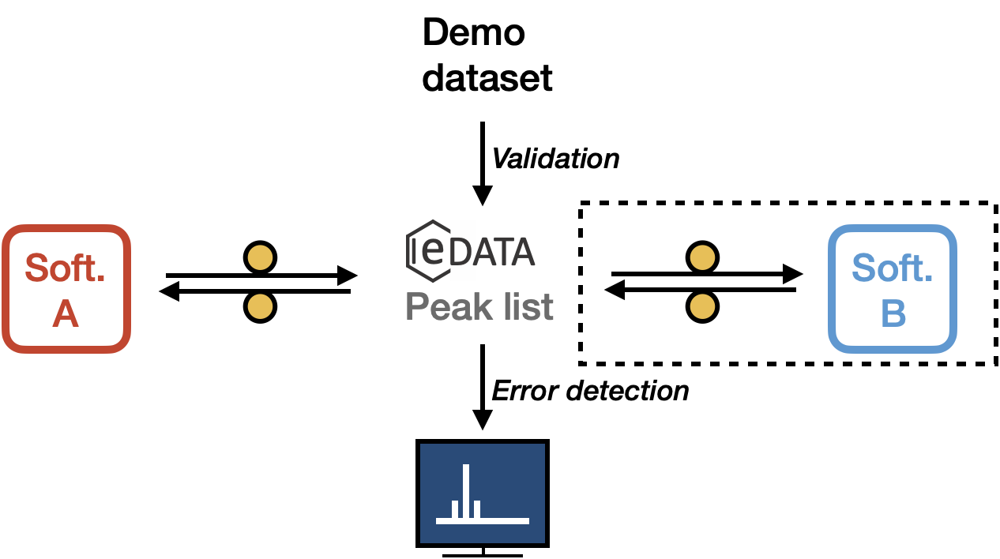

# Peak lists

We shall soon introduced a CHEMeDATA peaklist object to faciliate their interoprabilty.

The peaklist object will be an intermediate between:

- Lists of NMR transitions (from, say, quantum mecanic calculations) and NMR spectra objects.
- Peak lists of diverse origins (Mnova, Simpson, *etc.*)

See [Mnova reader](https://github.com/CHEMeDATA/MnovaJson-reader).
See **main pealist page**.

